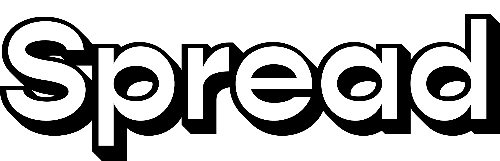
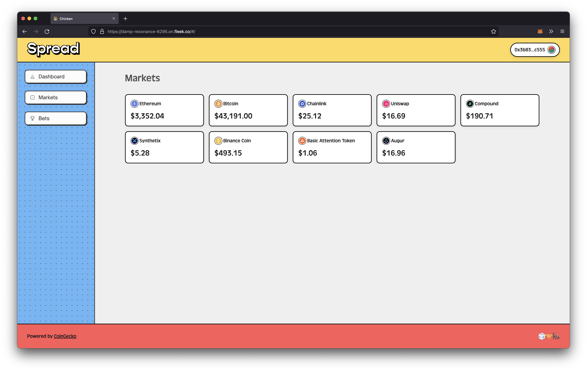
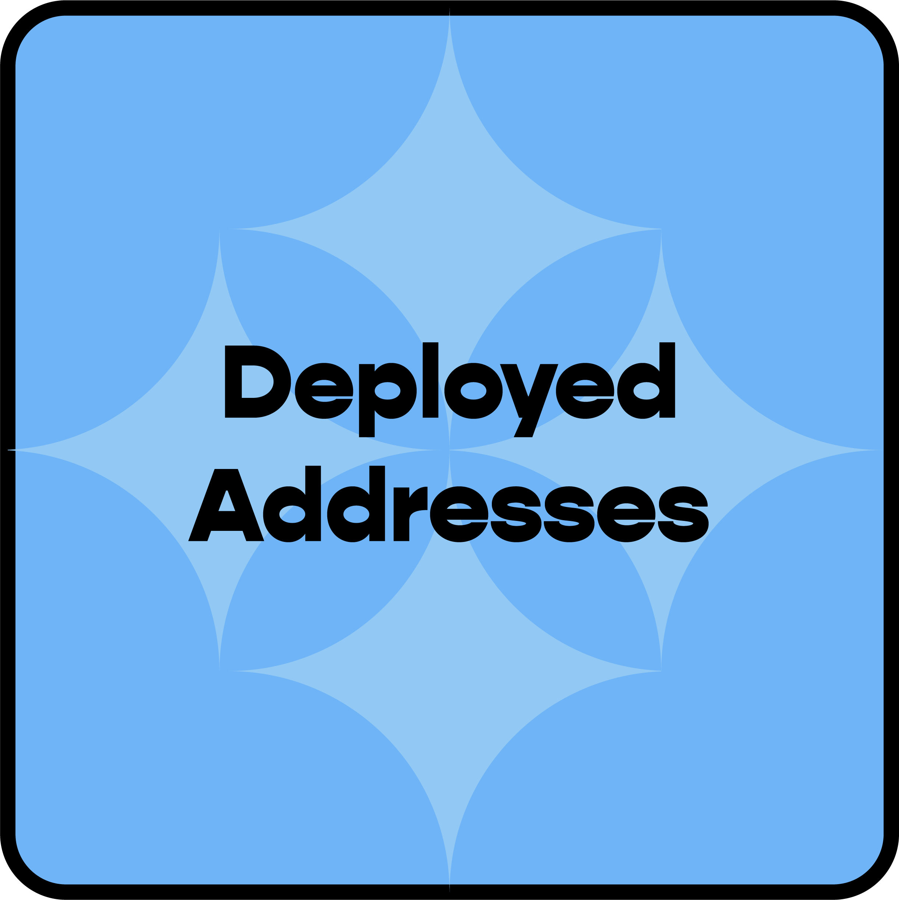
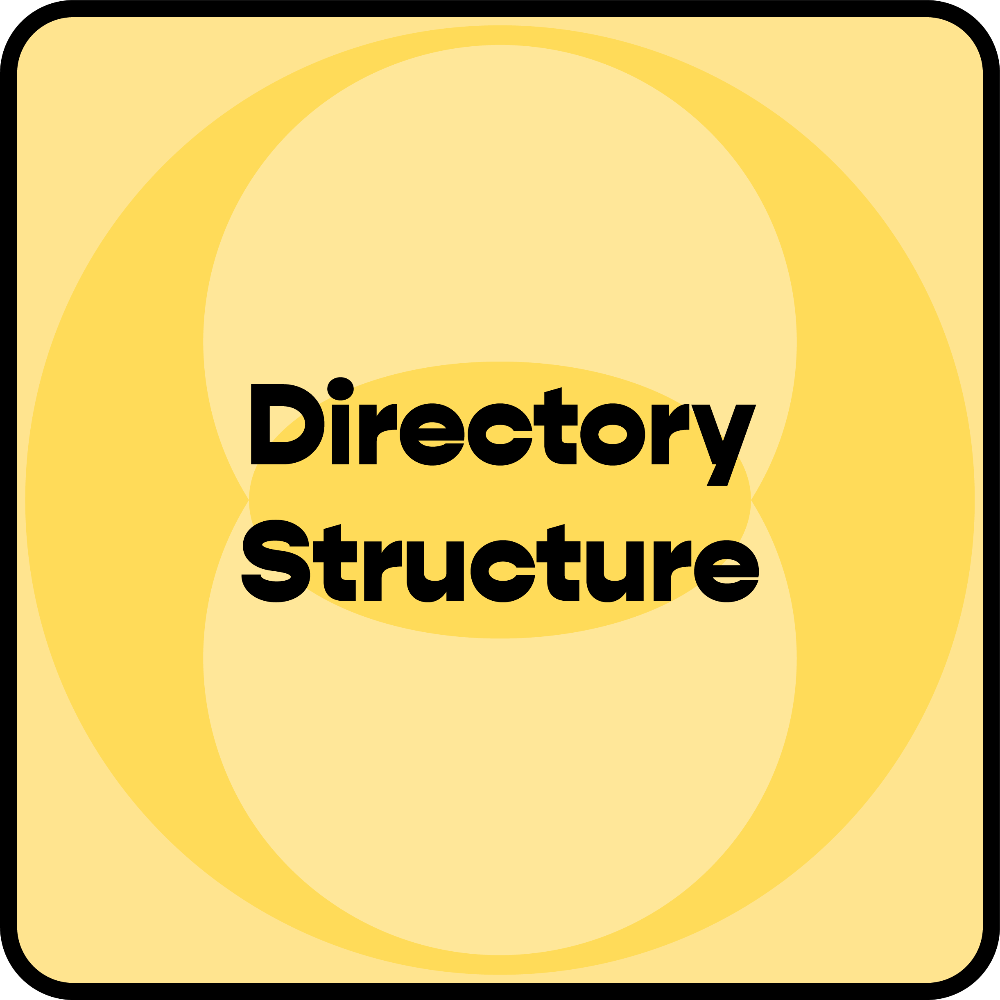
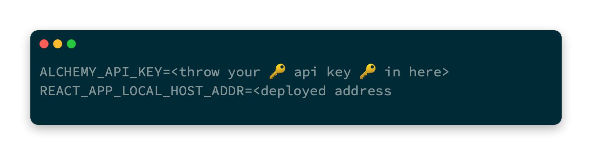
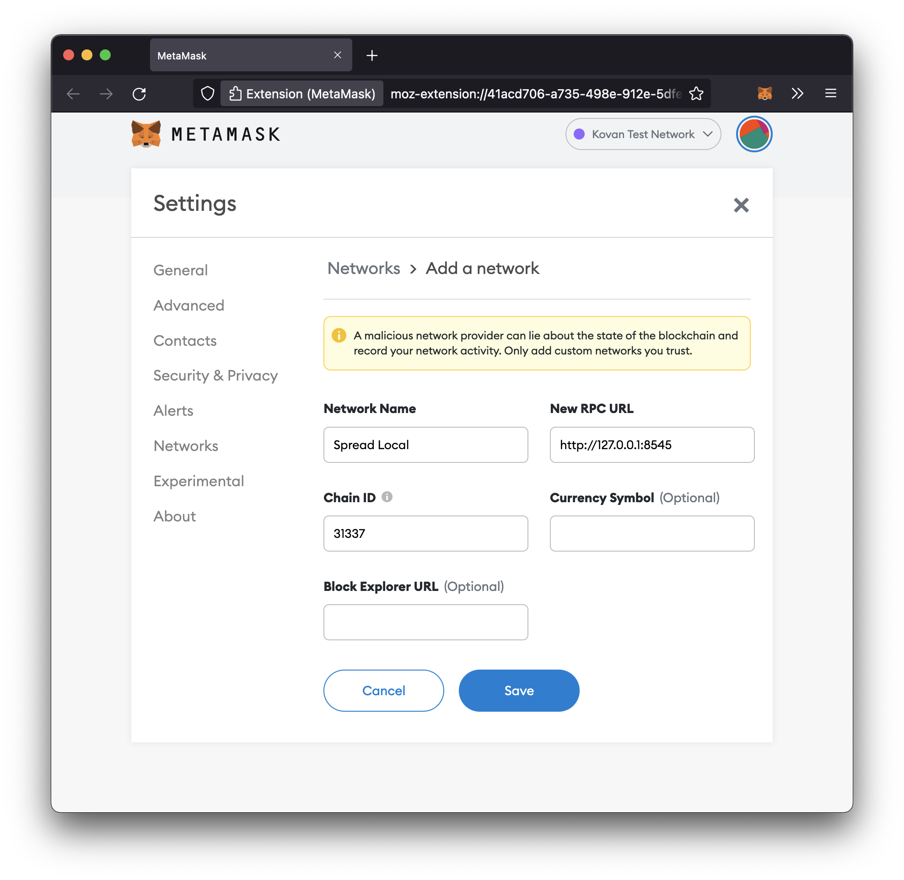
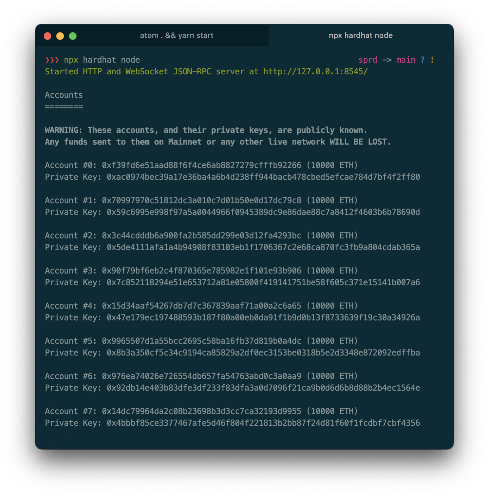
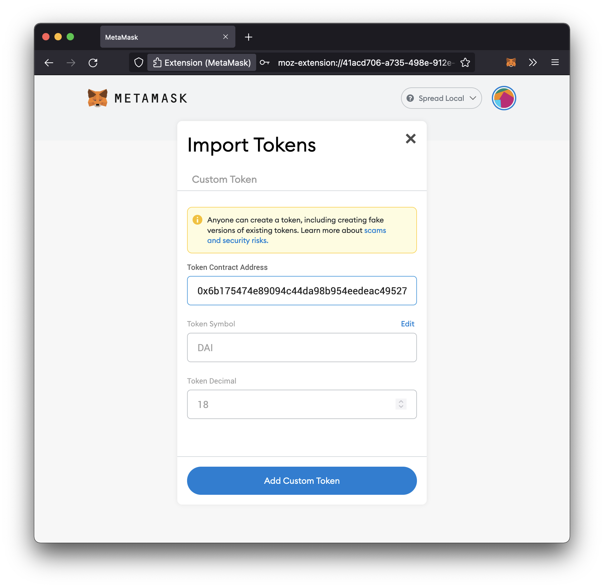

<div align=center>
  
</div>

<br />

<div align=center>
  <a href='https://damp-resonance-6295.on.fleek.co/'>
    
  </a>
  <a href='https://kovan.etherscan.io/address/0xF589B70705f859490658DA86a1220ea7496036f3'>
    
  </a>
</div>
<div align=center>
  <a href='https://www.loom.com/share/38a6aba9c2124a5ebe765188715cfc20'>
    
  </a>
  <a href='https://kovan.etherscan.io/address/0xF589B70705f859490658DA86a1220ea7496036f3'>
    
  </a>
</div>

___



Spread is betting dApp lets users challenge each other on the price movement of tokens by placing bets that can be settled after a set period of time.

## Docs
<div align='center'>
    <a href='docs/avoiding_common_attacks.md'>
      
    </a>
    <a href='docs/design_pattern_decisions.md'>
      
    </a>
    <a href='docs/deployed_address.txt'>
      
    </a>
    <a href='docs/directory_structure.md'>
      
    </a>
</div>

## Running this Locally
1. After you clone this repo, but before you do anything else, you'll want to get a shiny new API key from [Alchemy](https://dashboard.alchemyapi.io/).
2. Create a `.env` file. Copy what's in [.env.example](.env.example). Throw your API key in there.

3. Run `yarn install`.
4. Run `npx hardhat clean` to clear the cache and delete the artifacts.
5. Run `npx hardhat compile` to compile the smart contracts.
6. To get the local fork up and running, you'll want to run `npx hardhat node`.
7. Create a new network on MetaMask. The RPC URL should be `http://127.0.0.1.8545` and the Chain ID should be `31337`.

8. Go back to your terminal, when you run `npx hardhat node`, you'll also get 20 accounts preloaded with 10,000 ETH. Import any of those accounts into MetaMask.

9. Now in a new tab, run `yarn deploy`. Take the address from the cow. Copy and paste the address into your `.env`.
<p align=center>
  <strong>
    <em>But Dina, where do we get the test DAI from?</em>
  </strong>
</p>
<div align=center>
  
</div>
<br />

9. Open a new tab, run `yarn fund`. This lets us use [`hardhat_impersonateAccount`](https://hardhat.org/hardhat-network/reference/#hardhat-network-methods) to bankrupt a whale and give us test DAI. This script will only fund the first five accounts.
10. The DAI may not show up on MetaMask for you. If it doesn't, click on **Assets**, at the bottom, you should see **Import Tokens**. Since we're using a local fork of Mainnet, we can use the contract address for DAI on Mainnet which is [`0x6b175474e89094c44da98b954eedeac495271d0f`](https://etherscan.io/address/0x6b175474e89094c44da98b954eedeac495271d0f). When you click **Add Custom Token**, you'll see the balance of DAI show up. WAGMI. Even if it's on a local fork of Mainnet.

11. Run `yarn start`.
12. On MetaMask, click the blockie, go down to **Settings**, then to **Advanced**, and finally, ✨ **Reset Account** ✨.

### TLDR;
```shell
# First terminal tab
yarn install
npx hardhat clean && npx hardhat compile && npx hardhat node

# Second terminal tab
yarn deploy
yarn fund
yarn start
```

### Testing
```shell
npx hardhat test
```

## Address for Certificate
0x55F5843236D2e95E68E58cB05a43a09fa7745657
