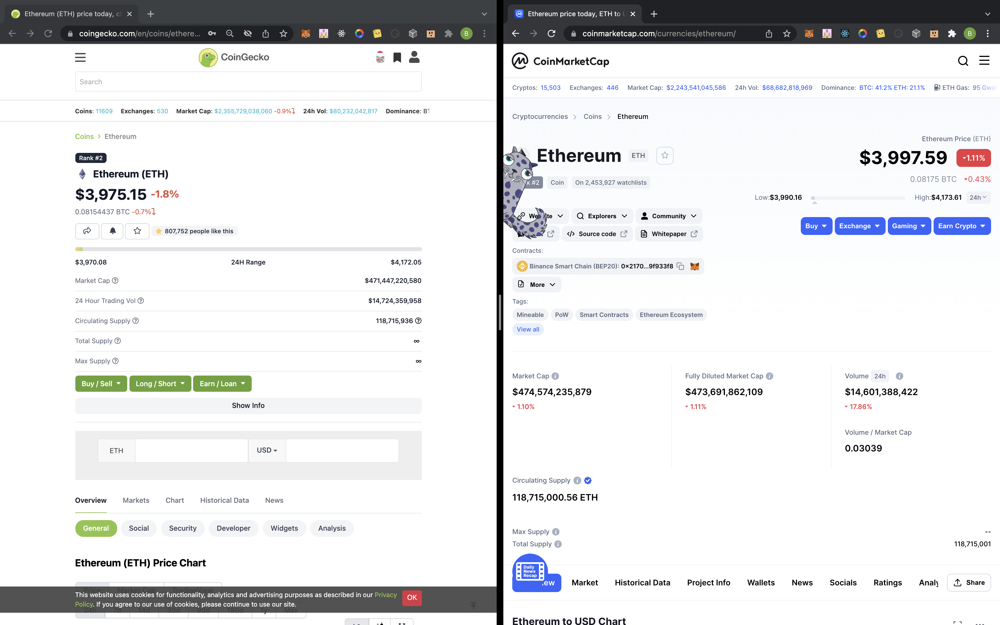

# Design Pattern Decisions

## Oracles
Asset price data is provided by [Chainlink Data Feeds](https://data.chain.link/). `Spread.sol` then references Chainlink's [AggregatorV3Interface](https://github.com/smartcontractkit/chainlink/blob/master/contracts/src/v0.8/interfaces/AggregatorV3Interface.sol) to grab [latestRoundData](https://docs.chain.link/docs/get-the-latest-price/) of any given asset.

`createBet` takes the argument of `_priceFeed` which is used to create a bet item that'll be pushed into the `bets` array.

In `settleBet`, `_priceFeed` is used to call `getLatestPrice`, a function defined in the AggregatorV3Interface which returns five values, one of them being the current `price`.

This is where in `settleBet`, the `settledPrice` is set to the price returned by `getLatestPrice`, and then compared against the `spreadPrice` set by the bet's creator.

```solidity
int currentPrice = getLatestPrice(bets[_betIndex].priceFeed);
bets[_betIndex].settledPrice = currentPrice;
```

I chose to use Chainlink because I needed a reliable source for asset price data. The only time I do use CoinGecko's API is for historical price data which is used solely for the chart on the front end-- even then, it's the free tier that doesn't require an account to use, and it times out for a minute after 50 API calls. The chart data itself has no impact on any of the contract calls.

<sub><sup>I just really wanted a trading view chart, honestly. They're really cool.</sup></sub>

If the API is down, the chart component will just render a skeleton loader. But each bet has a timestamp that the front end will need to check if enough time has elapsed to render a component that'll allow a user to call `settleBet`. So if the price returns null because of some failure, then `settleBet`'s logic can't maintain it's integrity.

Put aside potential failures, both CoinGecko and CoinMarketCap are a few amongst many *off-chain oracles* I can use, and yet they both show different price, market cap, 24h volume, and circulating supply data for Ethereum at **the same time**.


<sub><sup>Yes, I know there's a CryptoKitty on my screen. No, this wasn't intentional. It's entirely random. And it's from [Kitty Clicker](https://chrome.google.com/webstore/detail/kitty-clicker/nmjjmlhjfmaaceldcbmdndfokbigohkm). 10/10 would recommend.</sup></sub>

## Speedbump
Price oracles don't come without [risk](https://samczsun.com/so-you-want-to-use-a-price-oracle/).

A black swan event like Black Thursday left [Maker's Medianizer unable to update because of high gas prices, and Chainlink's Price Feed stalled for three hours.](https://insights.glassnode.com/what-really-happened-to-makerdao/)

But Chainlink's pricefeeds have parameters that trigger every price update: a deviation threshold, and a heartbeat.

> A new trusted answer is written when the off-chain price moves more than the deviation threshold, or 3600 seconds have passed since the last answer was written on-chain.

A speed bump works to delay contract actions in Solidity.

If, by some fluke, a pricefeed found itself unable to update, bets shouldn't be settled.

In `settleBet`, after `currentPrice` and `updatedAt` are returned from `getLatstPrice`, a require statement checks to make sure if the difference of the current `block.timestamp` and `updatedAt` is less than 3600 seconds. If it was greater than 3600 seconds, then the price feed is lagging, and the bet can't be settled.

## Inter-Contract Execution
Ethereum is at an ATH, and that's great but it wouldn't be a good idea to denominate a bet in it. The more risk-averse option would be to use a stablecoin like DAI. Doing so would mean I'd have to interact with the [`IERC20.sol` interface from OpenZeppelin](https://docs.openzeppelin.com/contracts/2.x/api/token/erc20), because DAI is an ERC20 token. On the front end, I would need access to methods like a user's balance, and the allowance they've enabled for `Spread.sol`. Then I would need to be able to set an allowance for my contract to have access to.

In `Spread.sol` I'm calling the `transferFrom` function from `IERC20.sol` to transfer DAI from either the creator or the challenger to `Spread.sol` and then back to the respective user if the bet settles in their favor.

## Inheritance
`Ownable.sol`'s only use for right now is restricting the whitelisting of pricefeeds to the owner.

This is important because [TokenPairs.js](../src/constants/TokenPairs.js) is a massive object full of Token... Pairs. Each has an image, an API ID for CoinGecko, and the Chainlink price feed address. The front end can only do so much to restrict someone from creating a bet with a pricefeed that doesn't belong to any token in that object, but it won't stop them from calling the `createBet` function from the console. Naturally, React will hate this very much.